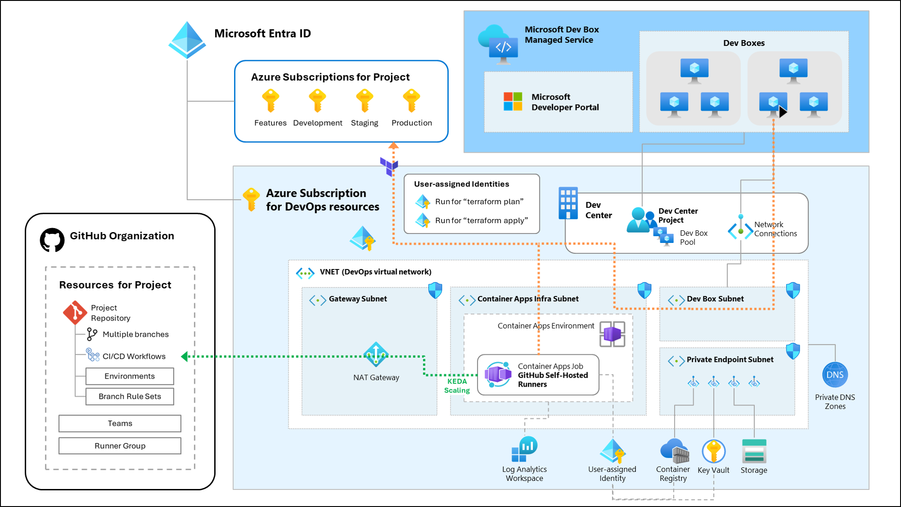

# Terraform を使った Azure リソース CI/CD デプロイのための DevOps ランディングゾーン

[English](./README.md) | [日本語](./README.ja.md)

---

## Table of Contents

- [概要](#overview)
- [はじめる](#getting-started)
  - [0\. 準備](#start-0-prerequisites)
  - [1\. ブートストラップ リソースのプロビジョニング](#start-1-provision-bootstrap)
  - [2\. DevOps ランディングゾーン リソースのプロビジョニング](#start-2-provision-devops-lz)
  - [3\. DevOps プロジェクト リソースのプロビジョニング](#start-3-provision-devops-project)
- [プロビジョニングされたリソースの例](#example-output)
- [このリポジトリの内容](#contents)
- [技術詳解](#tech-details)
  - [GitHub Actions ワークフロー アーキテクチャ](#tech-details-github-actions-workflow-arch)
- [謝辞](#acknowledgements)
- [コントリビューション](#contributing)

---

<a id="overview"></a>

## 概要

このリポジトリは、Terraform と CI/CD ワークフローを使用して Azure リソースをデプロイおよび管理するための、包括的なモジュール型の Infrastructure as Code ソリューションを提供します。Azure DevOps と GitHub ベースの CI/CD ワークフローの両方をサポートするように設計されており、組織は Git でバージョン管理された Infrastructure as Code を使用して、安全でスケーラブル、かつポリシーに準拠したクラウド環境のプロビジョニングを自動化できます。このモジュールによって提供されるプロジェクト Git リポジトリは、エンタープライズ環境で使用するように設計されており、Azure および Terraform のベスト プラクティスに準拠しています。


主な機能は次のとおりです。

- **モジュール型の Terraform アーキテクチャ**： 一般的な Azure および DevOps パターン用の再利用可能なモジュール
- **Azure DevOps と GitHub のサポート**： プロジェクト、リポジトリ、パイプライン、および、セルフホステッドエージェント/ランナーのプロビジョニング
- **セキュアな状態とシークレットの管理**： Azure Storage と Key Vault を使用して、Terraform の状態と機密情報を管理します
- **エンタープライズ対応**： デプロイメントタスク実行におけるセキュアなクローズドネットワーク、ID、リポジトリポリシー適用のためのベストプラクティスを実装しています
- **拡張性とカスタマイズ性**： さまざまな組織の要件やクラウドガバナンスモデルに容易に適応できます

`infra/terraform` ディレクトリには、すべてのコアインフラストラクチャコードが含まれており、明瞭性と拡張性を考慮して整理されています。チームは基盤となるリソースのブートストラップ、DevOps ランディングゾーンのデプロイ、プロジェクト固有の DevOps リソースの一貫した自動化された管理が可能となります。

> [!NOTE]
> 現時点では GitHub プロジェクトのみをサポートしています。
>
> 将来的に Azure DevOps プロジェクトをサポートする予定です。

## Azure アーキテクチャ

Azure ネットワークを含めたアーキテクチャは、以下の図の通りです。この図では、プライベート仮想ネットワークを有効にし、GitHub セルフホステッド ランナーを Azure Container App のジョブを使って、KEDA スケーリングを使ってイベント駆動型で CI/CD ワークフローのジョブを実行する構成を示しています。

また、開発者がセキュアな開発環境を使って Azure プロジェクトの開発を行うことができるよう、Microsoft Dev Box のためのプロジェクトが展開される構成を示しています。Dev Box の仮想テスクトップはプライベート仮想ネットワークに接続されるため、セキュアに Terraform 状態管理ファイルにアクセスを行い、Azure リソースの展開と管理を行うことができます。



<a id="getting-started"></a>

## はじめる

このモジュールを使って Azure リソースのデプロイを自動化する DevOps 環境を展開するには、各ステップに必要な準備を行ってから、以下のステップで実行します。

<a id="start-0-prerequisites"></a>

### 0. 準備

以下の準備を行ってください。

- Azure CLI
- Azure Subscriptions を管理する Entra ID テナント
- Azure Subscriptions (合計 5つ)
  - DevOps リソースを展開する Azure Subscriptions
  - プロジェクトで利用する Azure Subscription (4つ)
    - 開発者が機能開発作業に利用するサブスクリプション
    - 開発用のサブスクリプション
    - ステージング用のサブスクリプション
    - 本番展開用のサブスクリプション
- 上記の Azure Subscription に対する `所有者` または `共同開発者` の権限
  - このドキュメントの作業で利用するユーザーの権限
- GitHub PAT (Personal Access Token)
  - GitHub プロジェクトリソースのプロビジョニングのためのトークン (以下の権限を付与したトークン)
    - `repo`
    - `workflow`
    - `admin:org`
    - `user: read:user`
    - `user: user:email`
    - `delete_repo`
  - GitHub セルフホステッド ランナーのためのトークン
    - `repo`
    - `admin:org`

> [!NOTE]
> すべての Azure Subscription は同じ Entra ID テナント配下で用意してください。

> [!NOTE]
> 上記の GitHub PAT トークンは `classic` パーソナルアクセストークンについて説明しています。よりきめ細かな権限設定が可能な `fine-grained` アクセストークンも利用できます。

Azure CLI を使って準備した Entra ID にログインします。

```bash
az login --tenant <Tenant_Id>
```

> [!NOTE]
> 準備したすべてのサブスクリプションでリソースプロバイダーの登録を行ってください。
>
> このリポジトリで準備した Terraform IaC コードでは、事前に必要となるリソースプロバイダーの登録を行っておくことが必須条件となっています。また、このプラットフォームを利用する Azure プロジェクトで、このリポジトリで展開されるユーザー割り当て ID の権限で `terraform plan` を実行した際にエラーが発生する可能性があります。
>
> リソースプロバイダーの登録は、以下のフォルダのスクリプトを利用することで、指定したリソースプロバイダーの一括登録を行うことができます。
>
> ```bash
> cd $ProjectRoot/infra/terraform/_setup_subscriptions
> ./register_rps.sh -s <your_subscription_id>
> ```

<a id="start-1-provision-bootstrap"></a>

### 1. ブートストラップ リソースのプロビジョニング


ブートストラップ モジュール ([`infra/terraform/_bootstrap`](./infra/terraform/_bootstrap/)) を使って、DevOps 環境の基礎となるリソース (Azure Blob Storage および Key Vault) をプロビジョニングします。

```bash
cd $ProjectRoot/infra/terraform/_bootstrap
```

<a id="start-1-provision-bootstrap-1a"></a>

#### 1-a. パラメーター ファイルの準備

ブートストラップ リソースの展開には、サンプル パラメーター ファイル ([`infra/terraform/_bootstrap/terraform.tfvars.sample`](./infra/terraform/_bootstrap/terraform.tfvars.sample)) を参考にしてください。

```bash
cp terraform.tfvars.sample terraform.tfvars
```

指定可能なパラメーターは以下の通りです。

<a id="start-1-provision-bootstrap-parameters"></a>

| パラメーター                          | 型           | オプショナル | 説明                                                                                                                         |
| ------------------------------------- | ------------ | ------------ | ---------------------------------------------------------------------------------------------------------------------------- |
| `target_subscription_id`              | string       | いいえ       | DevOps ランディングゾーン (ブートストラップ リソース)をデプロイするための Azure サブスクリプション ID                        |
| `naming_suffix`                       | list(string) | はい         | リソース命名用のサフィックス (既定値: `["alz", "devops", "bootstrap"]`)                                                      |
| `location`                            | string       | いいえ       | DevOps リソースをプロビジョニングするリージョン                                                                              |
| `tags`                                | map(string)  | はい         | リソース タグ (既定値: `{}` [空のマップ])                                                                                    |
| `tfstate_container_name`              | string       | はい         | Bootstrap および DevOps リソースの Terraform 状態ファイル (`*.tfstate`) の Blob コンテナー名 (既定値: `tfstate`)             |
| `enable_user_assigned_identity`       | bool         | はい         | Bootstrap リソースのユーザー割り当て ID を有効にするかどうか (既定値: `false`)                                               |
| `enable_storage_customer_managed_key` | bool         | はい         | Blob Storage (tfstate) のカスタマー マネージド キー (CMK) を有効にするかどうか (既定値: `true`)                              |
| `customer_managed_key_policy`         | object       | はい         | カスタマー マネージド キーのポリシー (既定値: RSA 4096 ビット、90日で更新が必要)                                             |
| `bootstrap_config_filename`           | string       | はい         | ブートストラップ構成ファイルを保存するファイル名 (既定値: `./bootstrap.config.json`)                                         |
| `tfbackend_config_template_filename`  | string       | はい         | Terraform 状態管理ファイルの azurerm リモートバックエンド構成のテンプレートファイル名 (既定値: `./devops.azurerm.tfbackend`) |

<a id="start-1-provision-bootstrap-1b"></a>

#### 1-b. ブートストラップ リソースのプロビジョニング実行

Terraform を実行して、リソース プロビジョニングを実行します。
このリソースプロビジョニングでは、まず、Terraform 状態ファイルの管理をローカルで行います。

```bash
terraform init
terraform plan
terraform apply
```

プロビジョニング完了後、以下のファイルが生成されます。

- `backend.tf`
- `bootstrap.config.json` (または、`bootstrap_config_filename` で指定したファイル名)
- `devops.azurerm.tfbackend` (または、`tfbackend_config_template_filename` で指定したファイル名)

これらのファイルは、ブートストラップ リソースの構成情報を保存したファイルであり、次のステップで利用します。

<a id="start-1-provision-bootstrap-1c"></a>

#### 1-c. Terraform 状態管理ファイルの移行

また、以下のコマンドを実行することで、このリソース展開そのものの Terraform 状態ファイルの管理を azurerm リモートバックエンドで実施することができます。

```bash
terraform init -migrate-state
```

<a id="start-2-provision-devops-lz"></a>

### 2. DevOps ランディングゾーン リソースのプロビジョニング


ブートストラップ モジュールの展開が完了したら、次に、DevOps ランディングゾーン リソースのプロビジョニングを行います。

> [!NOTE]
>
> このステップで使用するすべての機密情報 (GitHub PAT など) は Bootstrap の Azure Key Vault で管理されます。

```bash
cd $ProjectRoot/infra/terraform/devops/lz
```

<a id="start-2-provision-devops-lz-2a"></a>

#### 2-a. パラメーター ファイルの準備

DevOps ランディングゾーン リソースのプロビジョニングには、サンプル パラメーター ファイル ([`infra/terraform/devops/lz/terraform.tfvars.sample`](./infra/terraform/devops/lz/terraform.tfvars.sample)) を参考にしてください。

```bash
cp terraform.tfvars.sample terraform.tfvars
```

> [!NOTE]
> このステップでは、プロビジョニング済みのブートストラップ リソースを利用するため、ブートストラップ リソースの構成情報を格納した JSON ファイルを `bootstrap_config_filename` に必ず指定してください。既定値を利用している場合は変更の必要はありません。

指定可能なパラメーターは以下の通りです。

<a id="start-2-provision-devops-lz-parameters"></a>

| パラメーター                                    | 型           | オプショナル | 説明                                                                                                                                           |
| ----------------------------------------------- | ------------ | ------------ | ---------------------------------------------------------------------------------------------------------------------------------------------- |
| `target_subscription_id`                        | string       | いいえ       | DevOps ランディングゾーン (DevOps ランディングゾーン リソース) をデプロイするための Azure サブスクリプション ID                                |
| `naming_suffix`                                 | list(string) | はい         | リソース命名用のサフィックス (既定値: `["alz", "devops"]`)                                                                                     |
| `location`                                      | string       | いいえ       | DevOps リソースをプロビジョニングするリージョン                                                                                                |
| `tags`                                          | map(string)  | はい         | リソース タグ (既定値: `{}` [空のマップ])                                                                                                      |
| `enable_self_hosted_agents`                     | bool         | はい         | セルフホステッド エージェント/ランナーを有効にするかどうか (既定値: `true`)                                                                    |
| `enable_private_network`                        | bool         | はい         | セルフホステッド エージェント/ランナーが実行されているプラ​​イベート仮想ネットワークを有効にするかどうか (既定値: `true`)                      |
| `enable_github`                                 | bool         | はい         | この DevOps リソースに対して GitHub を有効にするかどうか (既定値: `true`)                                                                      |
| `enable_devbox`                                 | bool         | はい         | この DevOps リソースに対して Microsoft Dev Box を有効にします (デフォルトは `true`)                                                            |
| `github_organization_name`                      | string       | いいえ       | GitHub の組織名                                                                                                                                |
| `github_personal_access_token`                  | string       | いいえ       | GitHub リソースのプロビジョニングに使用する GitHub パーソナル アクセス トークン                                                                |
| `github_personal_access_token_for_runners`      | string       | いいえ       | GitHub セルフホステッド ランナーに使用する GitHub パーソナル アクセス トークン                                                                 |
| `vnet_address_prefix`                           | string       | いいえ       | プライベート仮想ネットワークの仮想ネットワーク アドレス プレフィックス                                                                         |
| `vnet_private_endpoint_subnet_address_prefix`   | string       | いいえ       | プライベート仮想ネットワークのプライベート エンドポイント サブネット アドレス プレフィックス                                                   |
| `vnet_gateway_subnet_address_prefix`            | string       | いいえ       | プライベート仮想ネットワークのゲートウェイ サブネット アドレス プレフィックス                                                                  |
| `vnet_container_app_subnet_address_prefix`      | string       | いいえ       | プライベート仮想ネットワークの ACA サブネット アドレス プレフィックス                                                                          |
| `vnet_container_instance_subnet_address_prefix` | string       | いいえ       | プライベート仮想ネットワークの ACI サブネット アドレス プレフィックス                                                                          |
| `vnet_devbox_subnet_address_prefix`             | string       | いいえ       | プライベート仮想ネットワークの DevBox サブネット アドレス プレフィックス                                                                       |
| `vnet_private_endpoint_subnet_name`             | string       | はい         | プライベート仮想ネットワークのプライベート エンドポイント サブネット名 (既定値: `private-endpoints`)                                           |
| `vnet_container_app_subnet_name`                | string       | はい         | プライベート仮想ネットワークの ACA サブネット名 (既定値: `container-apps`)                                                                     |
| `vnet_container_instance_subnet_name`           | string       | はい         | プライベート仮想ネットワークの ACI サブネット名 (既定値: `container-instances`)                                                                |
| `vnet_devbox_subnet_name`                       | STring       | はい         | プライベート仮想ネットワークの DevBox サブネット名コメントを追加その他のアクション (既定値: `devbox`)                                          |
| `devbox_definitions_image_list`                 | list(string) | はい         | Dev Box 定義の Dev Box VM イメージのリスト (既定値: `["galleries/default/images/microsoftwindowsdesktop_windows-ent-cpc_win11-24h2-ent-cpc"]`) |
| `devbox_definitions_sku_list`                   | list(string) | はい         | Dev Box VM SKU のリスト (既定値: デフォルトでサポートされているすべての SKU)                                                                   |
| `enable_agents_environment_zone_redundancy`     | bool         | はい         | ACA のゾーン冗長化を有効化するかどうか (既定値: `true`)                                                                                        |
| `bootstrap_config_filename`                     | string       | はい         | ブートストラップ構成ファイルが保存されたファイル名 (既定値: `../../_bootstrap/bootstrap.config.json`)                                          |

<a id="start-2-provision-devops-lz-2b"></a>

#### 2-b. DevOps リソースのプロビジョニング実行

Terraform を実行して、リソース プロビジョニングを実行します。
このリソースプロビジョニングでは、まず、Terraform 状態ファイルの管理を azurerm リモートバックエンドで行います。

```bash
terraform init -backend-config ../../_bootstrap/devops.azurerm.tfbackend -backend-config key=devopslz.terraform.tfstate
terraform plan
terraform apply
```

<a id="start-3-provision-devops-project"></a>

### 3. DevOps プロジェクト リソースのプロビジョニング


DevOps ランディングゾーン リソースのプロビジョニングが完了したら、DevOps プロジェクトごとの個別のリソース (リポジトリ、CI/CD パイプライン、ユーザー割り当て ID、セルフホステッド ランナーのコンテナー実行のための環境) をプロビジョニングします。

このステップは、前のステップまでにプロビジョニングしたDevOps ランディングゾーン リソースを共有して利用し、プロジェクトごとに実行することが可能です。

```bash
cd $ProjectRoot/infra/terraform/devops/project_github
export project_name="<your-project-name>"
```

> [!NOTE]
> 現時点では GitHub プロジェクトのみをサポートしています。
>
> 将来的に Azure DevOps プロジェクトをサポートする予定です。

<a id="start-3-provision-devops-project-3a"></a>

#### 3-a. パラメーター ファイルの準備

プロジェクト リソースのプロビジョニングには、サンプル パラメーター ファイル ([`infra/terraform/devops/project_github/terraform.tfvars.sample`](./infra/terraform/devops/project_github/terraform.tfvars.sample)) を参考にしてください。

```bash
cp terraform.tfvars.sample terraform.tfvars
```

> [!NOTE]
> このステップでは、プロビジョニング済みのブートストラップ リソースを利用するため、ブートストラップ リソースの構成情報を格納した JSON ファイルを `bootstrap_config_filename` に必ず指定してください。既定値を利用している場合は変更の必要はありません。

> [!NOTE]
> このステップでは、プロビジョニング済みの DevOps ランディングゾーン リソースを利用するため、DevOps ランディングゾーンリソースをプロビジョニング時の Terraform 状態管理ファイルを利用します。このため、ステップ 2 にプロビジョニングの実行コマンドで指定した azurerm リモートバックエンドの `key` パラメーターを `devops_tfstate_key` に必ず指定してください。このドキュメントで指定した通り実行する場合は、既定値のままで問題ありません。

指定可能なパラメーターは以下の通りです。

<a id="start-3-provision-devops-project-parameters"></a>

| パラメーター                                     | 型          | オプショナル | 説明                                                                                                                                                                     |
| ------------------------------------------------ | ----------- | ------------ | ------------------------------------------------------------------------------------------------------------------------------------------------------------------------ |
| `target_subscription_id`                         | string      | いいえ       | DevOps Project リソースをデプロイするための Azure サブスクリプション ID                                                                                                  |
| `project_name`                                   | string      | いいえ       | プロジェクト名                                                                                                                                                           |
| `location`                                       | string      | いいえ       | DevOps プロジェクトリソースをプロビジョニングするリージョン                                                                                                              |
| `tags`                                           | map(string) | はい         | リソース タグ (既定値: `{}` [空のマップ])                                                                                                                                |
| `subscriptions`                                  | map(object) | いいえ       | DevOps プロジェクトで使用する Azure サブスクリプションのマップ型リスト                                                                                                   |
| `use_templates_repository`                       | bool        | はい         | DevOps プロジェクトでテンプレート リポジトリを使用するかどうか (既定値: `true`)                                                                                          |
| `use_runner_group`                               | bool        | はい         | DevOps プロジェクトで GitHub ランナー グループを使用するかどうか (既定値: `false`)                                                                                       |
| `use_self_hosted_runners`                        | bool        | はい         | DevOps プロジェクトで GitHub セルフホステッド ランナーを使用するかどうか (既定値: `true`)                                                                                |
| `self_hosted_runners_type`                       | string      | はい         | GitHub セルフホステッド ランナーのコンピューティング タイプ (オプション: "aca" または "aci") (既定値: `aca`)                                                             |
| `use_devbox`                                     | bool        | Yes          | Microsoft Dev Box を使用するかどうか; `devops/lz` モジュールをプロビジョニングする際に `enable_devbox` オプションを `true` に設定する必要があります (デフォルト: `true`) |
| `devbox_maximum_dev_boxes_per_user`              | number      | Yes          | 指定すると、プロジェクト内のすべてのプールで 1 人の開発者ユーザーが作成できる Dev Box の最大数を制限します (デフォルト: `2`)                                             |
| `devbox_local_administrator_enabled`             | bool        | Yes          | Dev Center プロジェクト プール内の Dev Box の所有者を Dev Box のローカル管理者として追加するかどうかを指定します (デフォルト: `true`)                                    |
| `devbox_stop_on_disconnect_grace_period_minutes` | number      | Yes          | 切断が検出された後、Dev Center Dev Box を停止するまでの待機時間 (分単位)。可能な値は 60 〜 480 です (デフォルト: `60`)                                                   |
| `bootstrap_config_filename`                      | string      | はい         | ブートストラップ構成ファイルを保存するファイル名 (既定値: `../../_bootstrap/bootstrap.config.json`)                                                                      |
| `devops_tfstate_key`                             | string      | はい         | DevOps ランディングゾーン リソースの Terraform 状態管理ファイル名（azurerm リモートバックエンドキー） (既定値: `devopslz.terraform.tfstate`)                             |

<a id="start-3-provision-devops-project-3b"></a>

#### 3-b. プロジェクト リソースのプロビジョニング実行

Terraform を実行して、リソース プロビジョニングを実行します。
このリソースプロビジョニングでは、まず、Terraform 状態ファイルの管理を azurerm リモートバックエンドで行います。

```bash
terraform init -backend-config ../../_bootstrap/devops.azurerm.tfbackend -backend-config key=${project_name}.terraform.tfstate
terraform plan
terraform apply
```

<a id="example-output"></a>

## プロビジョニングされたリソースの例

[このドキュメント](./docs/Example-of-DevOps-Landing-Zone.ja.md) では、プロビジョニングされたリソースの例について説明しています。

<a id="contents"></a>

## このリポジトリの内容

<a id="contents-dir-structure"></a>

### ディレクトリ構成

```text
infra/
└── terraform/
    ├── _bootstrap/
    ├── _setup_subscriptions/
    ├── devops/
    │   ├── lz/
    │   └── project_github/
    └── modules/
```

<a id="contents-bootstrap"></a>

### 1. Bootstrap リソース モジュール (`infra/terraform/_bootstrap/`)

このフォルダには、Terraform 状態管理とセキュアなシークレット保管に必要な基本的なブートストラップとなる Azure リソースのための Terraform コードと構成ファイルが含まれています。このモジュールでプロビジョニングされるリソースには以下が含まれます。

- Terraform 状態管理のための Azure Storage Account
- シークレットの保管のための Azure Key Vault

<a id="contents-devops"></a>

### 2. DevOps リソース モジュール (`infra/terraform/devops/`)

このフォルダには、DevOps リソースをプロビジョニングするための、環境固有およびプロジェクト固有の Terraform 構成が含まれています。このフォルダには、以下のサブフォルダが含まれます：

- `lz/`: ランディングゾーン リソース
  - Azure DevOps と GitHub Actions の両方に対応する、ネットワーク、アイデンティティ、セルフホステッド エージェント/ランナーのインフラストラクチャが含まれます。
- `project_github/`: プロジェクトレベルのリソース
  - GitHub ベースの Terraform IaC コードを管理する CI/CD プロジェクトのリソース (リポジトリ、ランナー、ワークフロー設定など) が含まれます。

<a id="contents-reusable-modules"></a>

### 3. `modules/`

一般的なインフラストラクチャ パターンに対応する再利用可能な Terraform モジュールのコレクション。以下が含まれます。

- `aca_env/`、`aca_event_job/`、`aca_manual_job/`: Azure Container Apps 環境とジョブのモジュール
- `aci/`: Azure Container Instances のモジュール
- `azure_devops/`、`azure_devops_agent_aca/`、`azure_devops_agent_aci/`、`azure_devops_pipelines/`: Azure DevOps プロジェクト、エージェント、パイプライン用のモジュール
- `github/`、`github_runner_aca/`、`github_runner_aci/`、`github_workflows/`: GitHub リポジトリ、セルフホステッド ランナー (ACA/ACI 上)、ワークフロー自動化用のモジュール
- `resource_providers/`: Azure リソース プロバイダーの登録と管理のモジュール (リファレンス実装のみでこのプロジェクトでは利用しない)

> [!NOTE]
> Terraform の `azurerm_resource_provider_registration` には、登録済みの Azure リソースプロバイダーを読み込むためのモジュールが用意されていません。Azure リソースプロバイダーの登録と登録解除は、複数の Terraform プロジェクトデプロイメント間で競合する可能性があり、またリソースプロバイダーの Terraform 状態管理も難しいため、使用すべきではありません。

<a id="tech-details"></a>

## 技術詳解

<a id="tech-details-github-actions-workflow-arch"></a>

### GitHub Actions ワークフロー アーキテクチャ

[このドキュメント](./docs/GitHub-Actions-Workflow-Architecture.ja.md) では、このリポジトリのプロジェクトでプロビジョニングされる GitHub Actions を使ったワークフローのアーキテクチャについて技術的な詳細な内容を解説しています。

<a id="acknowledgements"></a>

## 謝辞

このプロジェクトは [Azure Landing Zone Accelerator](https://github.com/Azure/alz-terraform-accelerator) プロジェクトから着想を得ています。[Azure Landing Zone Accelerator](https://github.com/Azure/alz-terraform-accelerator) プロジェクトは Azure Landing Zone デプロイメント専用の DevOps リソースに焦点を当てていますが、このプロジェクトは一般的な Azure デプロイメント プロジェクトに焦点を当てています。[Jared Holgate](https://github.com/jaredfholgate) 氏、および、プロジェクトの貢献者およびチーム メンバーの皆様に感謝申し上げます。

<a id="contributing"></a>

## コントリビューション

コントリビューションは大歓迎です！ 提案や改善点があれば、PR (Pull Request) を送信するか、Issues を作成してください。
